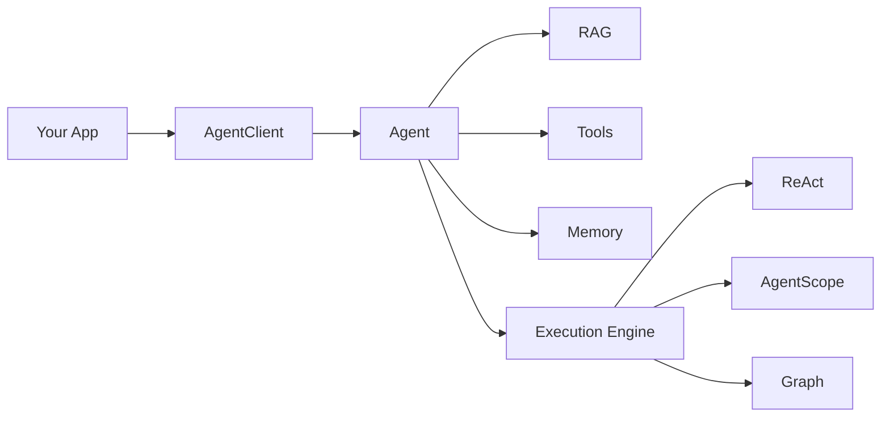

# Arctra DX V3 — 中文实现基线

> DX 北极星：**3 分钟理解、10 分钟运行、30 分钟扩展。**

## 1. 原则

```text
默认简单（Simple by Default）
设计上强大（Powerful by Design）
默认可观测（Observable by Default）
默认可测试（Testable by Default）
默认安全（Safe by Default）
通过 Spring 扩展（Extensible by Spring）
```

复杂性由框架吸收，而不是由用户承担。

## 2. 用户第一层心智模型

```text
Agent = 谁来决策
RAG   = 去哪里找知识
Tool  = 能做什么
```

进阶后再理解：

```text
Memory     = 记住什么
Evidence   = 为什么这么判断
Policy     = 能不能执行
Checkpoint = 怎么恢复
Engine     = Agent 采用什么执行机制
```

## 3. 第一层 API

```java
String answer = agentClient
        .agent("knowledge-agent")
        .user("Spring AI Tool Calling 是怎么工作的？")
        .call()
        .content();
```

同样 API 背后可以是 Native ReAct、AgentScope、Graph 或 Embabel，业务代码不变。

## 4. Engine 只在需要时出现

```yaml
developer-agent:
  agents:
    knowledge-agent:
      engine: react

    research-agent:
      engine: agentscope
```

默认使用 Native ReAct 时，用户甚至不需要显式配置 engine。

## 5. README 简单图



## 6. Quick Start

第一篇教程只做：

```text
1. 添加 Starter
2. 配置 Model
3. 定义 Agent
4. 注入 AgentClient
5. call()
```

不解释 DDD、Journal、Shared Kernel、Capability Model。

## 7. 文档按用户任务组织

优先回答：

```text
How do I create an Agent?
How do I add a Tool?
How do I enable RAG?
How do I add a Reranker?
How do I add Memory?
How do I require approval?
How do I use AgentScope?
How do I test an Agent?
How do I debug an Agent?
```

## 8. 文档目录

```text
docs/
├── getting-started/
│   ├── quick-start.md
│   └── first-agent.md
├── guides/
│   ├── add-tool.md
│   ├── enable-rag.md
│   ├── add-reranker.md
│   ├── use-memory.md
│   ├── human-approval.md
│   ├── use-mcp.md
│   ├── use-agentscope.md
│   ├── testing.md
│   └── debugging.md
├── concepts/
│   ├── agent.md
│   ├── rag.md
│   ├── tool.md
│   ├── memory.md
│   ├── evidence.md
│   ├── policy.md
│   └── execution-engine.md
├── architecture/
│   ├── overview.md
│   ├── runtime.md
│   ├── ddd.md
│   ├── retrieval.md
│   ├── tool-runtime.md
│   └── governance.md
├── integrations/
│   ├── agentscope.md
│   ├── graph.md
│   └── embabel.md
└── reference/
    ├── api.md
    ├── configuration.md
    ├── starters.md
    ├── metrics.md
    ├── events.md
    └── errors.md
```

## 9. Example 渐进式教学

Knowledge：

```text
01-basic
02-vector-rag
03-hybrid-rag
04-rerank
05-evidence
06-adaptive-rag
```

Incident：

```text
01-tool
02-tool-search
03-decision
04-policy
05-hitl
06-checkpoint
```

不要只提供一个巨大 enterprise-demo。

## 10. 错误体验

错误必须回答：

```text
What happened?
Why?
How to fix?
```

例如：

```text
Agent 'research-agent' requires MULTI_AGENT capability,
but engine 'react' does not provide it.

Available engine:
- agentscope

Fix:
developer-agent.agents.research-agent.engine=agentscope
```

不要只抛 `IllegalStateException`。

## 11. Diagnostics

`/actuator/arctra` 建议显示：

```text
Framework Version
Spring AI Version
Loaded Starters
Registered Agents
Selected Engines
Engine Capabilities
Retrievers
Rerankers
Tool Providers
Memory Provider
Checkpoint Provider
Warnings
```

## 12. Starter DX

引入：

```xml
<dependency>
    <artifactId>arctra-agentscope-starter</artifactId>
</dependency>
```

即可注册 AgentScope Engine。

不要求用户手工创建 Adapter、Factory 或 Runtime。

## 13. 扩展 DX

```java
@Bean
Retriever companyRetriever() {
    return new CompanyRetriever();
}
```

```java
@Bean
Reranker companyReranker() {
    return new CompanyReranker();
}
```

```java
@Bean
AgentExecutionEngine companyEngine() {
    return new CompanyExecutionEngine();
}
```

Spring Bean 是主要扩展入口。

## 14. API 稳定原则

公开概念尽量控制在：

```text
AgentClient
AgentDefinition
AgentResult
ExecutionEngine
Tool
Retriever
Reranker
Memory
Evidence
Policy
Checkpoint
```

不要让 Manager、Coordinator、Processor 淹没 Public API。

## 15. 学习路径

```text
Level 0  Run Example
Level 1  AgentClient
Level 2  RAG / Tool / Memory
Level 3  Policy / HITL / Evaluation
Level 4  ExecutionEngine
Level 5  AgentRuntime / Framework Extension
```

## 16. DX 验收

3 分钟：理解项目定位以及 Agent / RAG / Tool 关系。

10 分钟：运行 `knowledge-assistant`。

30 分钟：完成 Custom Tool 或 Custom Retriever。

60 分钟：将一个 Agent 从 Native ReAct 切换到 AgentScope，而业务调用 API 不变化。

## 17. 最终原则

> **让普通用户只看到 AgentClient，让高级用户逐层进入 Profiles、Extension API、ExecutionEngine 和 AgentRuntime。**

这样项目才能同时拥有低学习门槛与高扩展上限。

---

# 18. DX V3：吸收 Harness 后仍然保持简单

V6 内部新增：

```text
Capability Seam
Event Bus
Session Log
Replay / Fork
Sandbox
Skill
```

但这些概念不能全部出现在新用户第一屏。

DX 原则继续是：

> **Progressive Disclosure：能力逐层暴露。**

---

# 19. 新的用户认知阶梯

```text
Level 0
AgentClient

Level 1
Agent + RAG + Tool

Level 2
Memory + Policy + HITL

Level 3
Skill + Sandbox

Level 4
ExecutionEngine + Capability Provider

Level 5
Session / Replay / Fork / Runtime Kernel
```

普通业务开发者不需要知道 Event Bus 和 Session Log。

---

# 20. Harness 不应该成为用户术语负担

README 可以说：

> Production-ready Agent Engineering for Spring AI.

架构页再解释：

```text
Arctra internally works as an Agent Harness.
```

不要要求用户先学习“Harness”才能调用 Agent。

---

# 21. Capability DX

用户不学习 `Capability SPI`，而学习具体任务：

```text
Want another model?      → add model starter
Want AgentScope?         → add agentscope starter
Want Docker execution?   → add docker sandbox starter
Want Elasticsearch RAG?  → add elasticsearch starter
Want custom capability?  → define a Spring Bean
```

例如：

```java
@Bean
SandboxProvider sandboxProvider() {
    return new CompanySandboxProvider();
}
```

底层叫 Capability Seam，对用户仍然是熟悉的 Spring Bean / Starter。

---

# 22. Session DX

默认调用不暴露 Session：

```java
agentClient.agent("incident-agent")
        .user(question)
        .call();
```

需要连续会话时才出现：

```java
agentClient.agent("incident-agent")
        .session(sessionId)
        .user(question)
        .call();
```

需要恢复时：

```java
agentClient.resume(executionId, command);
```

高级调试才出现：

```java
agentClient.execution(executionId).replay();
agentClient.execution(executionId).fork(checkpointId);
```

这样 Replay/Fork 不污染主 API。

---

# 23. Skill DX

Skill 应让“复杂能力组合”更容易，而不是引入另一套 Agent DSL。

用户可以：

```java
@Agent(
    name = "incident-agent",
    skills = {"incident-diagnosis", "kubernetes"}
)
```

或者 Definition：

```java
AgentDefinition.builder()
        .name("incident-agent")
        .skills("incident-diagnosis", "kubernetes")
        .build();
```

Skill 文档重点解释“能解决什么”，而不是内部由多少 Tool/Prompt/Policy 组成。

---

# 24. Sandbox DX

开发者工作平台里，Sandbox 是非常重要的 DX 能力。

用户应该能够通过 Starter 获得默认实现：

```xml
<dependency>
    <artifactId>developer-agent-docker-sandbox-starter</artifactId>
</dependency>
```

配置：

```yaml
developer-agent:
  sandbox:
    provider: docker
    timeout: 5m
```

而不是要求用户理解容器生命周期管理。

---

# 25. Debug Timeline

Session Log 最直接的用户价值不是“Event Sourcing”，而是一个好用的 Timeline：

```text
09:31:02  User Request
09:31:03  Retrieval: 18 → rerank → 5
09:31:04  Decision: inspect logs
09:31:04  Tool: queryLogs
09:31:05  Evidence: SQL exception
09:31:06  Policy: read-only allowed
09:31:07  Decision: schema mismatch
09:31:08  Final Answer
```

文档和 UI 应优先叫：

```text
Execution Timeline
Replay
Resume
Fork
```

而不是让普通用户面对 Event Store / Projection 等实现术语。

---

# 26. Diagnostics V3

`/actuator/arctra` 增加：

```text
Registered Capabilities
Capability Implementations
Selected Execution Engines
Event Subscribers
Session Store
Sandbox Provider
Skills
```

同时提供明确冲突诊断：

```text
Multiple SandboxProvider beans found:
- dockerSandboxProvider
- companySandboxProvider

No provider was marked @Primary and no explicit provider was configured.
```

---

# 27. Starter 命名必须可预测

统一：

```text
developer-agent-{capability}-{provider}-starter
```

或在没有歧义时：

```text
developer-agent-{provider}-starter
```

示例：

```text
arctra-elasticsearch-starter
arctra-agentscope-starter
developer-agent-docker-sandbox-starter
developer-agent-jdbc-session-starter
```

用户应该能够猜到 artifactId，而不是查表才能找到。

---

# 28. 文档增加 Troubleshooting 与 Recipes

新增：

```text
docs/
├── recipes/
│   ├── build-code-agent.md
│   ├── incident-agent.md
│   ├── knowledge-agent.md
│   ├── approval-workflow.md
│   └── replay-an-execution.md
└── troubleshooting/
    ├── model.md
    ├── retrieval.md
    ├── tool.md
    ├── engine.md
    ├── sandbox.md
    └── session.md
```

Guide 教能力，Recipe 教完整问题，Troubleshooting 教排障。

---

# 29. DX V3 验收标准

```text
3 min   理解 Agent / RAG / Tool
10 min  跑通第一个 Agent
30 min  自定义 Tool / Retriever
45 min  接入一个 Starter Capability
60 min  切换 ExecutionEngine
90 min  看懂 Timeline，并完成一次 Resume / Replay
```

高级能力存在，不代表第一天就必须学习。

---

# 30. DX V3 最终原则

```text
Internal Architecture:
Stable Kernel + Capability Seam + Event Bus + Session Log

External Experience:
AgentClient + Starter + Spring Bean + Clear Diagnostics
```

也就是说：

> **内部可以像一个成熟 Harness，外部必须仍然像一个好用的 Spring Boot 开源项目。**
